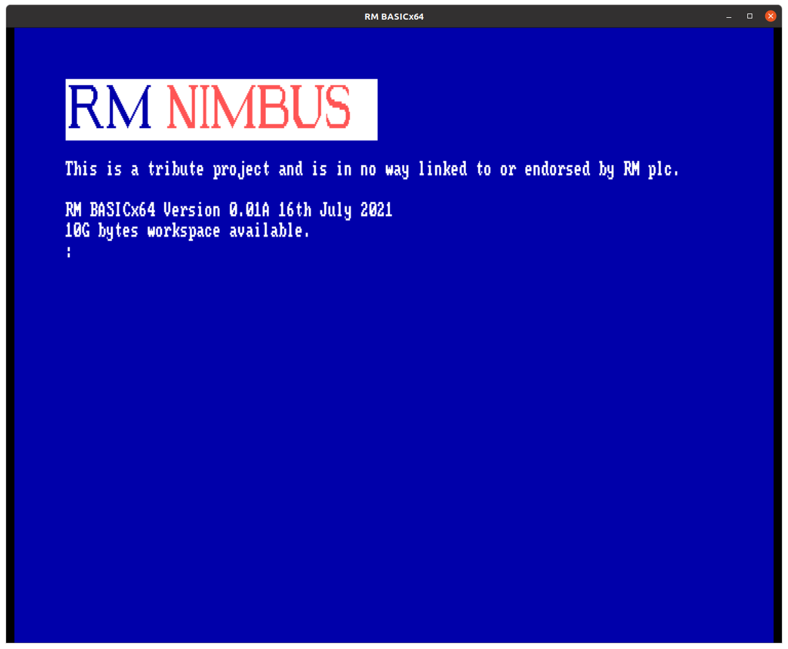
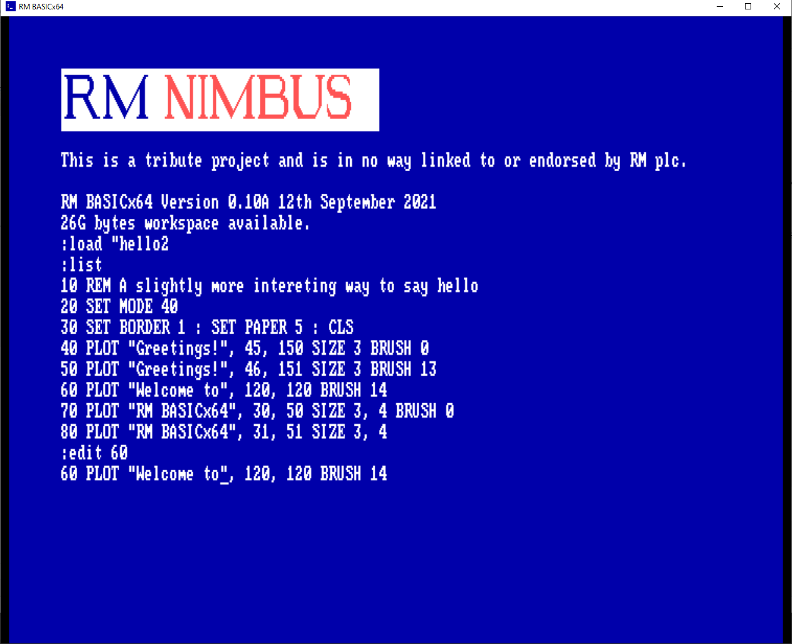
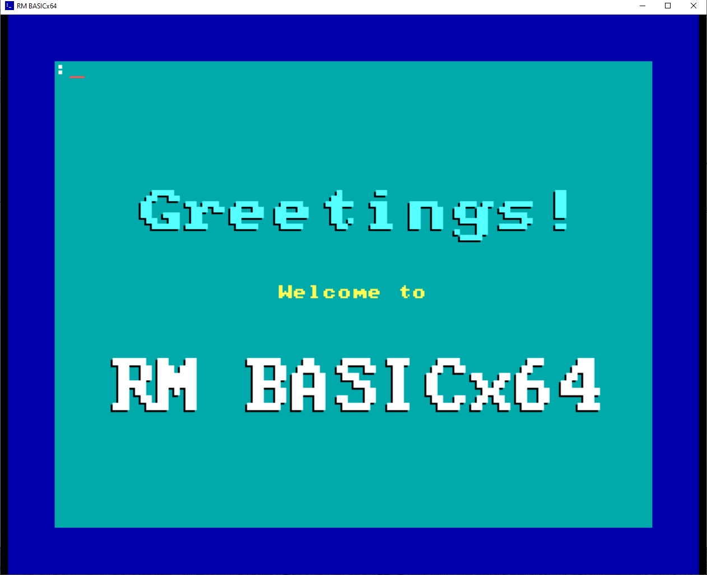
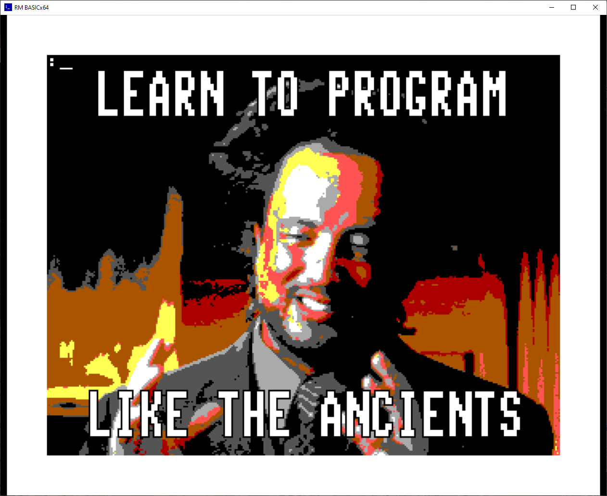

# RM BASICx64
{: .fs-9 }
A 64-bit backwards-compatible RM Basic interpreter for Windows and Linux.
{: .fs-6 .fw-300 }
_RM BASICx64 is a tribute project and is in no way linked to or endorsed by RM plc._

[Get it now](#get-it-now){: .btn .btn-primary .fs-5 .mb-4 .mb-md-0 .mr-2 } [View on GitHub](https://github.com/adamstimb/rmbasicx64){: .btn .fs-5 .mb-4 .mb-md-0 }

---

## It's a what now?

RM BASICx64 is a re-implementation the RM Basic language developed by Research Machines in 1984 for the RM Nimbus PC-186.  RM BASICx64 looks and behaves like the original, but under the  hood it takes full advantage of modern computer architectures by supporting 64 bit floating point numbers, extremely deep expression evaluation, and vast amounts of workspace memory.

## Project status

Over half of the original language specification has been implemented so far.  The code has not been hardened so may crash unexpectedly or produce strange errors.  Before rushing to install please see the [release notes](docs/releases.html) to manage your expectations.

## Get it now

[Download the installer - 6.2Mb (Windows only)](assets/downloads/rmbasicx64setup.exe)

or [build from source (Windows or Linux)](https://github.com/adamstimb/rmbasicx64)

Then try the [Quick start guide](docs/quickstart.html)

## Screenshots

RM BASICx64 running on Windows 10

Editing a program

Using big fonts to say hello

The Mandelbrot Set

Making daft memes with RM Basic

## Authorship

RM BASICx64 was written in [Go](https://golang.org/) by Tim Adams, leaning heavily on the [ebiten](https://ebiten.org/) game engine, and borrowing with merry abandon from [Writing An Interpreter in Go](https://interpreterbook.com/) by Thorsten Ball.  The language has been re-implemented according to available documentation but does not re-use any of the original code of RM Basic.

This website was written by Tim Adams using [Just the Docs](https://pmarsceill.github.io/just-the-docs/).

Contact me on [github](https://github.com/adamstimb), [linkedin](linkedin.com/in/adamstimb) or [twitter](https://twitter.com/TimAdam80276952).

## License

RM BASICx64 is distributed with an [Apache 2.0 license](https://github.com/adamstimb/rmbasicx64/tree/master/LICENSE).

